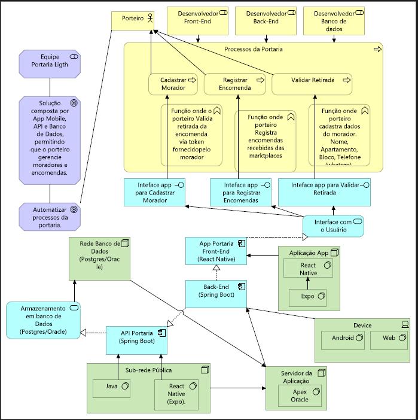
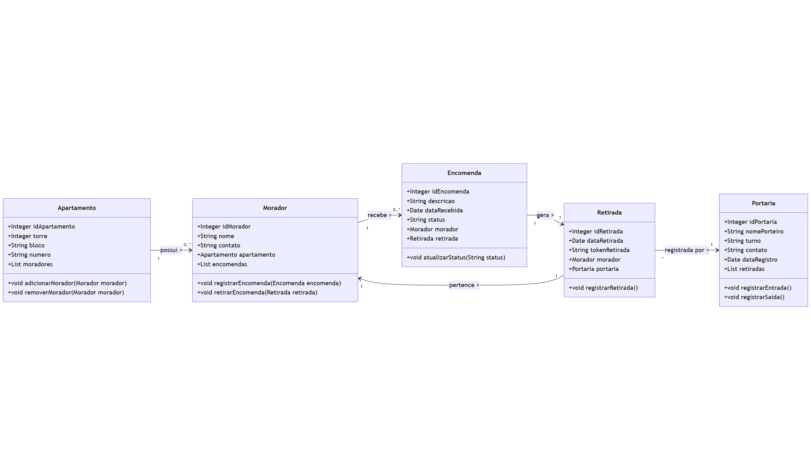
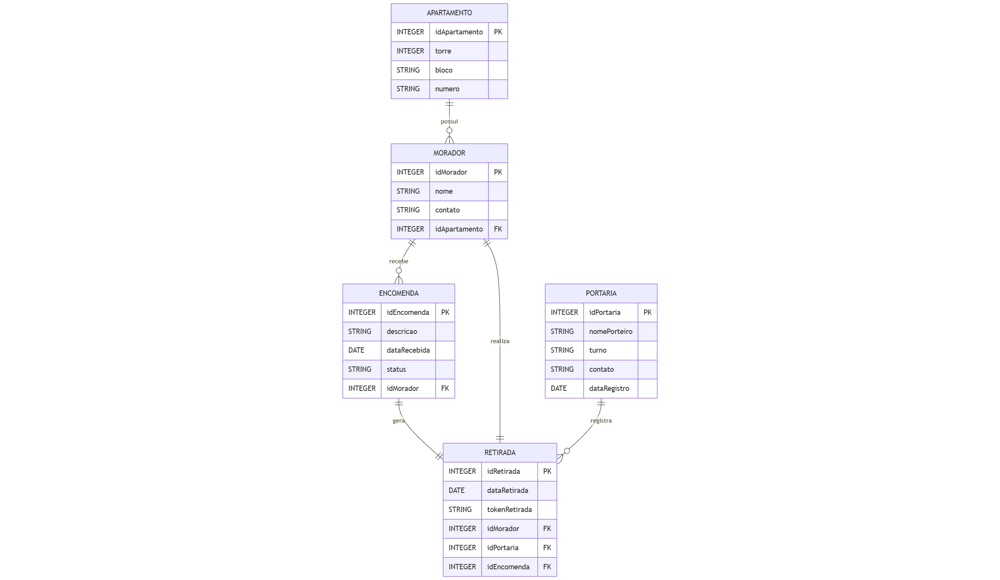
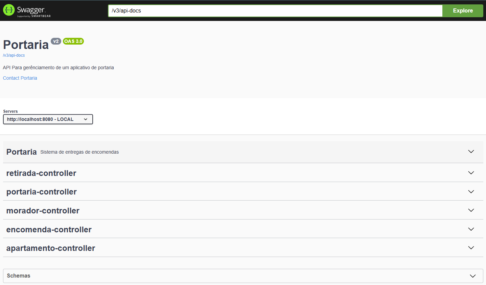
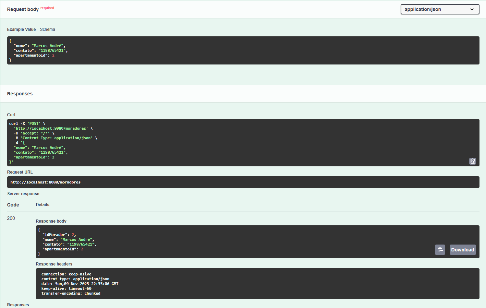
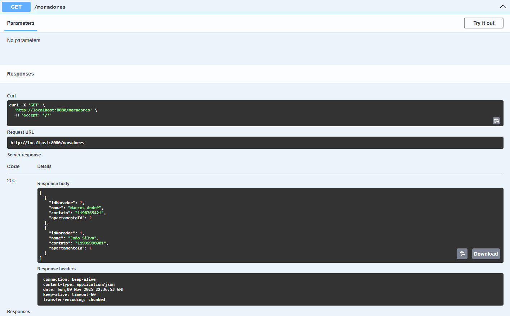
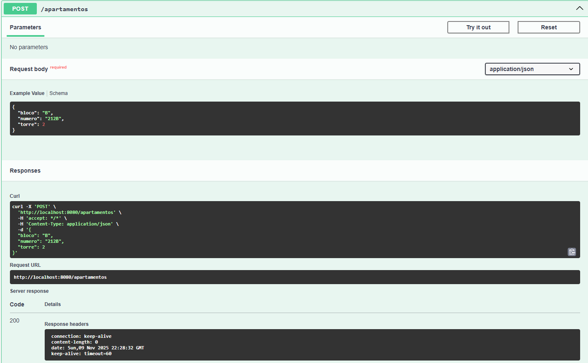

# 🏢 Sistema de Gestão de Portaria

## 📋 Descrição
Sistema para gerenciamento de portaria de condomínio, focado no controle de entrega e retirada de encomendas. A aplicação permite o registro, acompanhamento e controle de encomendas recebidas na portaria do condomínio.

## 👥 Integrantes e Responsabilidades

- **Lucas da Ressurreição Barbosa (RM560179)**
  - Java Advanced
  - IOT
  - Documentação técnica

- **Fabrício José da Silva (RM560694)**
  - Banco de Dados
  - .NET
  - Estrutura total do Banco

- **Ranaldo José da Silva (RM559210)**
  - DevOps e CI/CD
  - Testes de qualidade
  - FrontEnd Mobile

## 🛠️ Tecnologias Utilizadas

- **Backend**: Java 21, Spring Boot 3.2, JPA/Hibernate
- **Banco de Dados**: Oracle Database
- **Documentação**: Swagger/OpenAPI
- **Testes**: JUnit 5, Postman
- **Build**: Gradle
- **Controle de Versão**: Git/GitHub

## Cronogrâma Técnico

[👉 Acesse o Cronograma da Sprint 2](docs/CRONOGRAMA_SPRINT_2.md)

## 🏗️ Diagramas da Arquitetura



### Diagrama de Classes


### DER (Diagrama Entidade-Relacionamento)


### Explicação dos Relacionamentos
- **Morador ↔ Apartamento**: N:1 (Muitos moradores em um apartamento)
- **Encomenda ↔ Morador**: N:1 (Muitas encomendas para um morador)
- **Encomenda ↔ Retirada**: 1:1 (Uma encomenda tem uma retirada)
- **Retirada ↔ Portaria**: N:1 (Muitas retiradas por uma portaria)

## 💾 Implementação JPA/Hibernate

### Estratégia de IDs
- IDs gerados manualmente via procedures no banco
- Uso de `EntityManager` para buscar próximo ID disponível
- Mapeamento ORM com anotações JPA (@Entity, @Table, @Id)

### Entidades Implementadas
- **`Apartamento`** - Torre, bloco, número
- **`Morador`** - Nome, contato, apartamento
- **`Encomenda`** - Descrição, data recebida, status
- **`Retirada`** - Data retirada, token, morador, portaria
- **`Portaria`** - Nome porteiro, turno, contato, data registro

## 🌐 API RESTful - Documentação com Swagger

### Princípios REST Aplicados
- Recursos nomeados corretamente (/moradores, /apartamentos, /encomendas)
- Verbos HTTP semânticos (GET, POST, PUT, DELETE)
- Status codes apropriados (200, 201, 404, 500)
- JSON como formato de dados

### Documentação Interativa
Acesse a documentação completa em: `http://localhost:8080/swagger-ui.html`



## 🚀 Como Executar

### Pré-requisitos
- JDK 21
- Gradle 8.x
- Oracle Database 19c
- Git

### Configuração
1. Clone o repositório:
```bash
git clone https://github.com/Lucas2000-student/Sprint-Portaria.git
```
2. Configure as variáveis de ambiente:

```bash
DB_URL=jdbc:oracle:thin:@//localhost:1521/xe
DB_USER=seu_usuario
DB_PASS=sua_senha
```
3. Execute a aplicação:
```bash
./gradlew bootRun
```
4. Acesse a aplicação:
```bash
http://localhost:8080
```
## 📚 Documentação da API

### Endpoints Principais

#### 🏠 Apartamentos
- `GET /apartamentos` - Lista todos os apartamentos
- `POST /apartamentos` - Cadastra novo apartamento
- `GET /apartamentos/{id}` - Busca apartamento por ID
- `PUT /apartamentos/{id}` - Atualiza apartamento
- `DELETE /apartamentos/{id}` - Remove apartamento

#### 👨‍👩‍👧‍👦 Moradores
- `GET /moradores` - Lista todos os moradores
- `POST /moradores` - Cadastra novo morador
- `GET /moradores/{id}` - Busca morador por ID
- `PUT /moradores/{id}` - Atualiza morador
- `DELETE /moradores/{id}` - Remove morador

#### 📦 Encomendas
- `GET /encomendas` - Lista todas as encomendas
- `POST /encomendas` - Registra nova encomenda
- `GET /encomendas/{id}` - Busca encomenda por ID
- `PUT /encomendas/{id}` - Atualiza encomenda
- `DELETE /encomendas/{id}` - Remove encomenda

#### 🏢 Portaria
- `GET /portarias` - Lista todos os registros de portaria
- `POST /portarias` - Registra novo porteiro/turno
- `GET /portarias/{id}` - Busca portaria por ID
- `PUT /portarias/{id}` - Atualiza portaria
- `DELETE /portarias/{id}` - Remove portaria

#### 🎫 Retiradas
- `GET /retiradas` - Lista todas as retiradas
- `POST /retiradas` - Registra nova retirada
- `GET /retiradas/{id}` - Busca retirada por ID
- `PUT /retiradas/{id}` - Atualiza retirada
- `DELETE /retiradas/{id}` - Remove retirada

## 🧪 Evidências de Teste

### Testes de Persistência



### Testes de Procedures


### Execução de Testes Automatizados
```bash
./gradlew test
```

## 🎥 Vídeo de Apresentação

📹 **Assista ao vídeo**: [LINK_DO_VIDEO_AQUI]

### Conteúdo do Vídeo:
- **Proposta Tecnológica**: Arquitetura baseada em Spring Boot e Oracle
- **Público-Alvo**: Porteiros, síndicos e moradores de condomínio
- **Problemas Resolvidos**:
  - Controle eficiente de entrada/saída de encomendas
  - Rastreabilidade completa das entregas
  - Redução de extravios e conflitos
  - Gestão organizada da portaria
- **Demonstração**: Funcionalidades principais e endpoints da API

## 📊 Funcionalidades Principais

- ✅ Cadastro de moradores e apartamentos
- ✅ Registro de encomendas recebidas
- ✅ Controle de retiradas com token
- ✅ Gestão de portaria e turnos
- ✅ Procedures para operações críticas
- ✅ API RESTful documentada
- ✅ Validações de dados e relacionamentos
